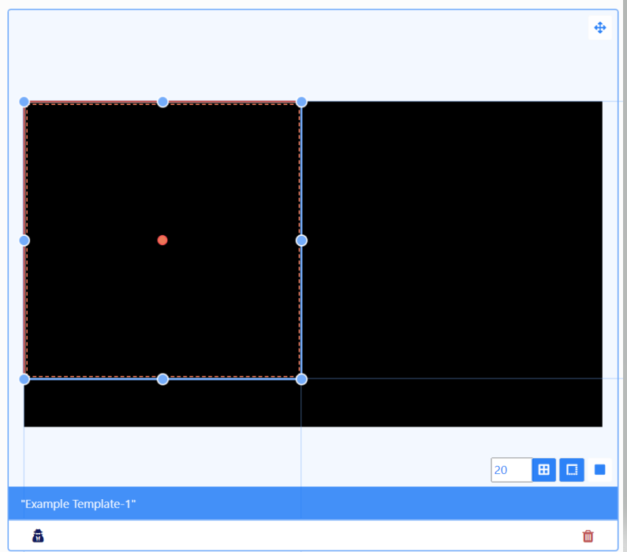
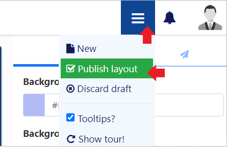

# Templates

Use Templates to speed up the design process and ensure a corporate standard is maintained.

## Feature Overview:

- Use existing published Layout designs to easily save as Templates.
- Create and manage Templates from a dedicated page for easier management.
- Add Zones to Templates to act as content placeholders on a Layout.
- Set Share options to restrict User access to selected zones on a Template.
- Show Published Templates for selection in the Layout Editor.
- Speed up the entire Layout design process for all Users.
- Apply a standardised look to all Layouts.

Create new [Templates](layouts_templates.html#content-create-template) or save your existing [Layout](layouts_templates.html#content-save-layout-as-template) designs to use as Templates for future Layouts.

{nonwhite}
Select from one of our designed templates from the [Xibo Exchange.](layouts.html#content-xibo-exchange) by clicking the button below Templates from the Toolbox.
{/nonwhite}

{version}
Selecting a Template will replace the current Layout design to the chosen Template. This action is irreversible and so must be used with caution.
{/version}

## Create Template

Templates are created by selecting **Templates** under the **Design** section of the main CMS menu.

- Select the **Add Template** button and complete the form fields.

[Folders](tour_folders.html) are used to organise, search and easily [Share](users_features_and_sharing.html#content-share) User objects with other Users/User Groups. Templates saved to a Folder will inherit the access options applied to that Folder.

{tip}
If Users should also have access to the content of the Template (image media files for example), ensure that these are also saved to the same Folder!
{/tip}

- Give your Template a **Name** for easy identification in the CMS and include optional [Tags](tour_tags.html).

- Select the [Resolution.](layouts#content-resolutions) 

On **Saving**, the [Layout Editor](layouts_editor.html) will automatically open with one full size **Zone**.

Zones are used to define areas on a Layout which content can be added to.

{tip}
If you don't want to include any Zones and add content directly to the Template, remove the Zone from the canvas by right clicking and selecting **Delete**. Add content in the same way as creating a [Layout](layouts.html).
{/tip}

### Adding Zones

{tip}
Zones are only available for use with Templates!
{/tip}

- Click anywhere on the zone to resize and position:

{tip}
Use the buttons, in the bottom right to select to **Snap to Grid**, **Snap to Borders** or **Snap to Elements** for easier positioning when adding items.
{/tip}

**Zones** can be added from the toolbar:

- Click on the top **Widget** button.

- Select the Zone and drag and drop or click to add.
- Resize and Position.

{tip}
Set to **Loop** only if the Zone contains a Widget that needs to update periodically (e.g. RSS Ticker) and it needs to update more frequently than the duration of the overall Layout.
{/tip}

### Layering

From the Properties Panel, select the Positioning tab to set [Layering](layouts_editor.html#content-layering) for overlapping Zones/ added content.

{tip}
Right click to show a [Context Menu](layouts_editor.html#content-context-menu) and easily move items backwards and forwards.

[Sharing](users_features_and_sharing.html#content-share) options are particularly useful if you want a User to only have access to a section of the Layout to manage.
{/tip}

Add both [content](layouts_editor.html#content-toolbox) from the Toolbox and Zones to build your Template design. 

{tip}
Adding multiple media items to one zone will automatically create a [Playlist](layouts_editor_playlists.html)!
{/tip}

Once your Template is complete, use the menu at the top of the editor to **Publish**:

Published **Templates** will show for selection from the Toolbox of the Layout Editor.

## Save Layout as Template

Published Layouts can be saved as a **Template** from two locations:

- From the [Layout Editor](layouts_editor.html):
  - After **Publishing** go back to the menu and select **Save Template**:

- From the [Layouts](layouts.html#content-layout-grid) grid:
  - Use the row menu for a **Published** Layout and **select Save Template**.

Complete all relevant form fields to save the selected Layout as a Template.

{tip}
Optionally use the tick box to also include all added **Widgets** to the Template!
{/tip}

- **Save**

{tip}
Layouts that are saved as a Template can be viewed and edited from the **Templates** grid under the **Design** section of the main CMS menu.

**Tagging** a Layout as a 'Template' will also add your designs to your Template list!
{/tip}

## Row Menu

All Templates have a row menu where Users can access a list of actions/shortcuts.

- Notable settings are listed below:

#### Alter Template 

Select to make design changes to the Template in the Layout Editor.

#### Checkout

To make edits to a Published Template click to **Checkout** and create a draft. Once edited the Template can be published to make the changes permanent overwriting the existing Template. Discard will revert the Template back to its original published state.

{tip}
Take your time with any edits you need to make as using **Checkout** ensures that no changes are made to your published version or shown on scheduled **Displays** until you choose to do so. **Publish** confirms changes have been made and will overwrite your published version. **Discard** will delete the draft with the published version remaining untouched.
{/tip}

#### Publish

Publish will ensure that the Template is shown for selection from the Toolbox.

#### Discard 

Discard all changes made to a draft and revert back to the previous Published version.

#### Share

Set [Share](users_features_and_sharing.html#content-share) options for User/User Group access to individual Templates.

#### Export 

Export the Template including all associated Widgets/Media/DataSet structures to a ZIP file, so it can be easily shared. 

{tip}
When exporting a Template, all assigned **Layout**, **Playlist** and **Media Tags** will be exported. Select the **Import Tags** option to add these Tags on Layout Import.

Use the **With Selected** option at the bottom of the Templates grid to perform bulk actions for multiple Templates! 
{/tip}

#### Next...

[Overlay Layouts](layouts_overlay.html)

