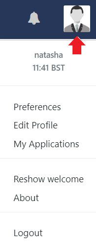
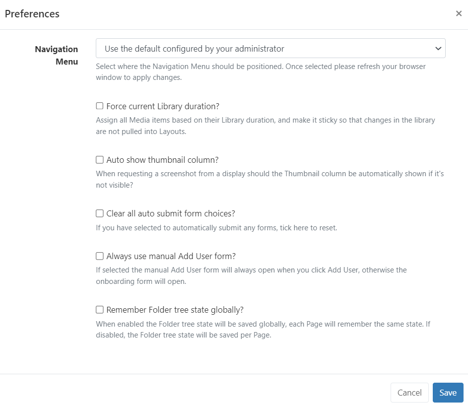
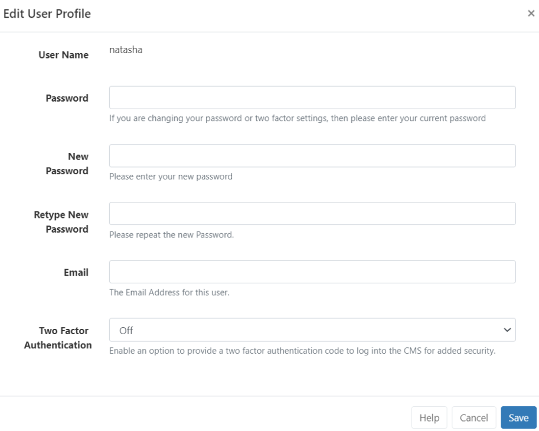

# First time User Access

Enter the web address (URL) of your CMS instance. Your **Super Administrator** will be able to tell you where to go to log in and give you your initial login credentials to access the CMS.

During the CMS installation process, a **Username** and **Password** is provided which grants unrestricted access to all areas of the CMS as a [Super Administrator User](users_administration.html#content-super-admin-user). Administrators have a number of login management options which can be set for [Users](users_administration.html) from [CMS Settings](tour_cms_settings.html#content-users).

## Login

The CMS is protected by an authentication system, enter your **Username** and **Password** and click to login. All pages in the CMS are authenticated and if you are not logged in a login form will appear.

{tip}
The CMS uses cookies to track whether a User is logged in or not. If you are experiencing trouble logging in you may need to adjust your browser settings for cookies.
{tip}

Once logged in you will see your [User Dashboard](users_dashboards.html), which serves as your homepage. 

{tip}
The Dashboard and main menu items are based on the enabled [Features](users_features_and_sharing.html) you have been given within the system!
{/tip}

We recommend that Users change their password after first time log in from the **Edit Profile** section of the **User Profile**.

## User Profile

Located in the top right of the CMS, click on the icon to manage your **User Profile** settings, reshow the short '**Welcome**' tour of the CMS to assist with navigation and functionality, and  securely **Logout** of the CMS after each User session:

{tip}
The CMS time and timezone which has been set in the **Regional** [CMS Settings](tour_cms_settings.html#content-regional) are shown here!
{/tip}

## Preferences

Preferences can be set which will only be enabled for the logged in User. 

{tip}
The list of options may differ from what is shown below as they are dependent on the [Feature](users_features_and_sharing.html) access enabled for each User.
{/tip}

 Use the available options to enhance your User role within the CMS:

{tip}
If you make changes to the **Navigational Menu** positioning for your CMS, ensure you refresh your browser to apply the change!
{/tip}

## Edit Profile

We strongly recommend that all Users change their initial password after first login. You may have also been prompted by the system to change your password from [User Settings](users_administration.html#content-force-password-change) applied by your Administrator.

- Click on **Edit Profile** to open:

You may have to adhere to a [Password Policy](tour_cms_settings.html#content-password-policy), as set by your Administrator when attempting to change your password. A text prompt will be shown to explain what is needed (minimum number of characters etc.) in order to meet the requirements of the set policy.

{nonwhite}
{cloud}
Customers with [Xibo Cloud Hosting](/hosting) have a **set default policy** which requires a password of at least 10 characters.
{/cloud}
{/nonwhite}

If you have a [Forgotten your Password](tour_cms_settings.html#content-password-reminder) reset link on the Login page, ensure that your correct **Email** address is entered in your User Profile. Once clicked a Password Reset Notification will be sent to your email address with further instructions to ensure you quickly regain access to the CMS.

## Two Factor Authentication

Users can configure Two Factor Authentication options for **Email** or **Google Authentication** to complete login by entering a code to further confirm the identify of who is logging into the CMS. 

### Email

{version}
**NOTE:** Administrators will need to ensure that a **Sending Email** address has been added via the [CMS Settings](tour_cms_settings.html#content-network) page in order for Users to start receiving email notifications.
{/version}

- Select Email
- Ensure that an **Email** address has been provided on the User Profile form and click to **Save**.

Once enabled, on each login after entering the **Username** and **Password** you will be asked to provide the 6 digit code shown in the **email** sent to the provided email address to complete log in.

### Google Authenticator

{version}
**NOTE:** Administrators will need to enter the name via the [CMS Settings](tour_cms_settings.html) page,  that should appear as the issuer with the Google Authenticator app. 
{/version}

- Install the [Google Authenticator app](https://play.google.com/store/apps/details?id=com.google.android.apps.authenticator2) to your mobile device.
- Select Google Authenticator.
- Scan the **QR code** shown on the Edit User Profile form and enter the code displayed into the Access Code field and **Save** to complete the set up.

Once enabled, after entering the **Username** and **Password** you will be asked to provide the 6 digit **code** displayed in the Google Authenticator app to complete log in each time.

{tip}
Ensure that your phone and server have the correct time and date to avoid errors.
You will need to enter your password to verify any changes made to the **Two Factor Authentication** options.
{/tip}

### Generate Recovery Codes

On saving a Two Factor Authentication option you will now need to generate recovery codes to be used if access to the configured email address or Google Authenticator app is lost.

- Click on **Generate**.
- **Copy** the codes and store them in a safe place like Password Manager.
- Click **Save** to make the codes active.

If you need to view the generated codes at anytime, click on **Show**.

{version}
**NOTE:** Clicking on Generate will invalidate any existing generated codes.
{/version}

{tip}
If you have no access to the email or app and cannot retrieve recovery codes, please contact your Administrator to [Reset Two Factor Authentication](users_administration.html#content-reset-two-factor-authentication)!
{/tip}

### My Applications

Applications that a User has authorised to act on their behalf within the CMS can be viewed here. Any questions regarding Applications please speak with your Administrator.

{tip}
At the current time the CMS does not provide individual Users with a method of revoking access to an application. Please speak with your Administrator to request removal of an [Application](tour_cms_settings.html#content-applications).
{/tip}

#### Next...

[Navigating the CMS](tour_cms_navigation.html)
