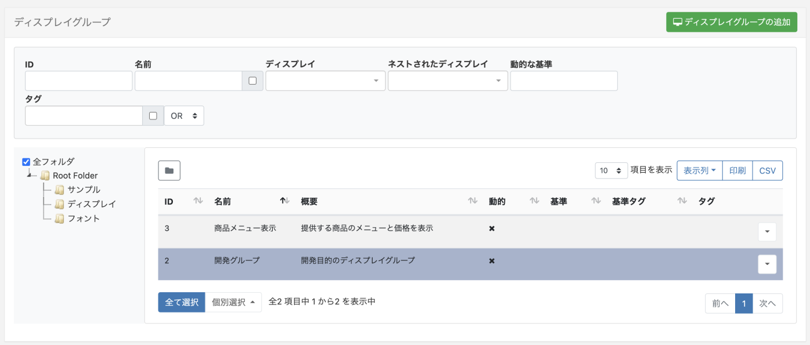
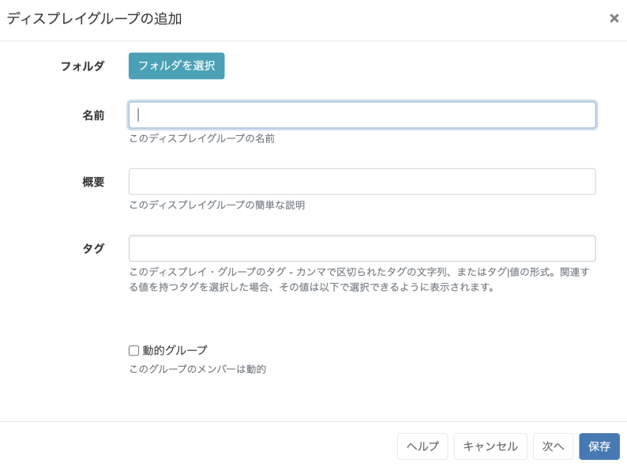
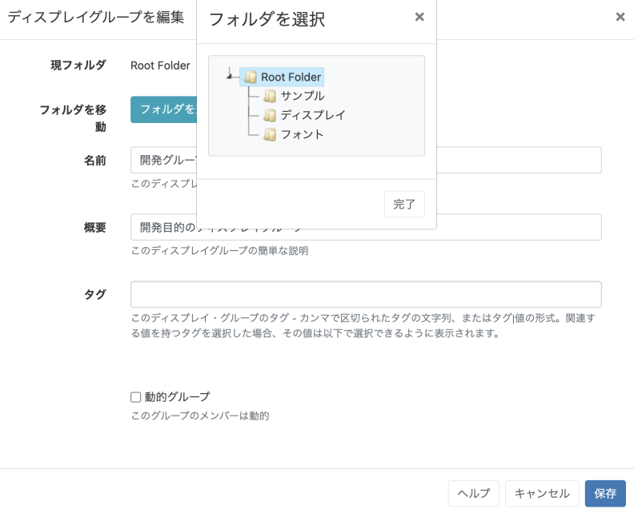
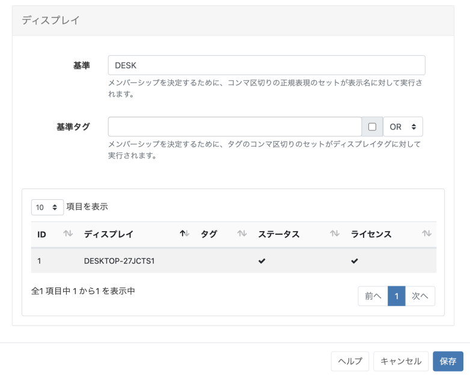
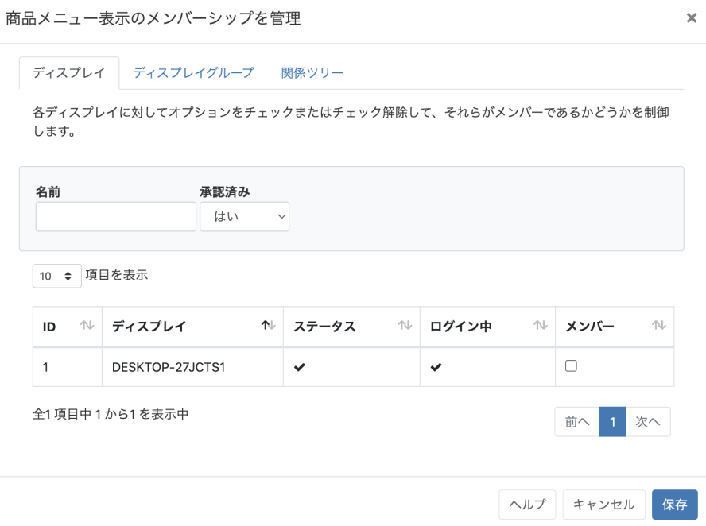

<!--toc=displays-->

# ディスプレイグループ

**スケジューリング**と**メディア割り当て**を容易にするために、ディスプレイグループを作成し、1つまたは複数のディスプレイグループにディスプレイを割り当てます。

ディスプレイグループは、CMSのメインメニューから**ディスプレイ**セクションの下にある**ディスプレイグループ**をクリックすることで管理されます。ディスプレイグループグリッドが表示され、新しいディスプレイグループの追加と既存のディスプレイグループの管理ができます。

デフォルトでは、**フォルダ**ツリーが開きます。

- フォルダ/サブフォルダをクリックすると、その内容が検索され、グリッドにフィルタに基づいて検索された結果が返されます。

または

- **全てのフォルダー** にチェックを入れると、ルートフォルダでの検索を含み、グリッドに適用されたフィルターに基づいた結果を返します。

{tip}
フォルダのアイコンをクリックすると、表示/非表示を切り替えることができます。 フォルダーを非表示にすると、選択したフォルダーのファイルパスが表示されます。
{/tip}

{tip}
ログインしたユーザーは、アクセス権が与えられているディスプレイの状態のみを見ることができます。
{/tip}

## 追加/編集 

**ディスプレイグループを追加**ボタンをクリックして新しいディスプレイグループを作成するか、行メニューを使用して既存のディスプレイグループを**編集**してください。

### フォルダー

ディスプレイグループは、オプションでフォルダーに保存することができます。

{tip}
フォルダに保存されたディスプレイグループは、ユーザー/ユーザーグループの保存先フォルダに適用された表示、編集、削除の共有オプションを引き継ぎます。
{/tip}

- フォルダーの選択ボタンをクリックしてツリーを展開し、保存/移動先のフォルダーを選択します。

- フォルダを右クリックして、保存するフォルダを新規に作成したり、その他のオプションにアクセスすることも可能です。

{tip}
利用可能なオプションは、ユーザー/ユーザーグループに対して有効な[機能と共有](users_features_and_sharing.html)オプションが適用されます!
{/tip}

フォルダアクセスとセットアップに関する詳細については、管理者にご相談ください。

{tip}
グリッド下部の個別選択オプションを使用して、複数のディスプレイグループをフォルダに割り当てることができます。
{/tip}

### タグ

ディスプレイグループには、オプションでタグを付けることができます。 タグフィールドにテキストを入力すると、オートコンプリートヘルパーが一致する可能性のあるタグを表示し、ユーザーがすでにシステムに追加されたタグを簡単に選択できるようになります。

タグにあらかじめ定義された値が必要な場合は、タグの値のドロップダウンメニューに表示され、既知の値はフィールドに直接入力することができます。

{tip}
管理者によって値が「必須」に設定されている場合、フォームを保存するために値を入力する必要があります。
{/tip}

ユーザーは、**タグ値** フィールドを使用して、定義済みの値をまだ値を持っていないタグに関連する値を追加することができます。タグ値が必要ない場合は、このフィールドを空白にすることができます。

{tip}
ディスプレイグリッドの下部にある[個別選択](tour_grids.html#複数選択-個別選択による)を使って、複数のディスプレイグループにタグを割り当てることも可能です!
{/tip}

使用する**タグ**と**タグ値**の詳細については、管理者にご相談ください。

## メンバー

ディスプレイグループのメンバーシップは、**手動割り当て** または **動的グループ** を使用したフィルターによって制御されます。

### 動的グループ

チェックすると、そのディスプレイグループに属するディスプレイを選択するために使用する、1つまたは複数の正規表現を入力するための追加フィールドが表示されます。

動的グループのフィルターは、正規表現の形式ですが、単純な文字列比較も可能です。正規表現はカンマで区切り、接頭辞 `-` で否定することができます。

{tip}
例えば、"a "を含み "b "を含まないすべてのディスプレイは `a,-b`となります。
{/tip}

{tip}
複数のタグが設定されているディスプレイでは、OR/ANDフィルタを追加して基準タグをフィルタリングすることができます。
{/tip}

### 手動割り当て

**ディスプレイグループを追加**]が完了し保存した後、行メニューから**メンバー**を選択してディスプレイを割り当てます。

選択されたディスプレイ/ディスプレイグループの**メンバー**チェックボックスを使用して、メンバーシップを制御します。

{tip}
**関係ツリー**タブで、編集中のディスプレイグループの祖先と子孫の関係を表示します。
{/tip}

## ネストされたグループ

ディスプレイグループは、ネストして複雑な構造を作ることができ、ターゲットを絞ったスケジューリングが可能です。

{tip}
グループ構造の例

- サイト1
- サイト1 - ビルディングA
- サイト1 - ビルディングA -  1階
- サイト1 - ビルディングA -  2階
- サイト1 - ビルディングB

ディスプレイのメンバーシップは最下層のグループに設定され、それらのグループは次のレベルに属し、さらにそのグループは最上位の親「サイト1」に属します。
CMSは循環参照（サイト1がサイト1 - ビルディングAを持ち、サイト1 - ビルディングAがサイト1を持つようなループを作る割り当て）を作成することを許可していません。

{/tip}

ディスプレイグループに設定された**スケジュール**、**メディアファイル**、**レイアウトの割り当て**は、グループ内の全メンバーに適用されます。

