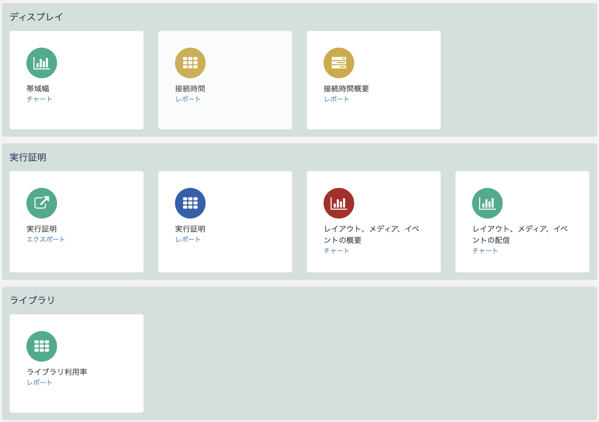
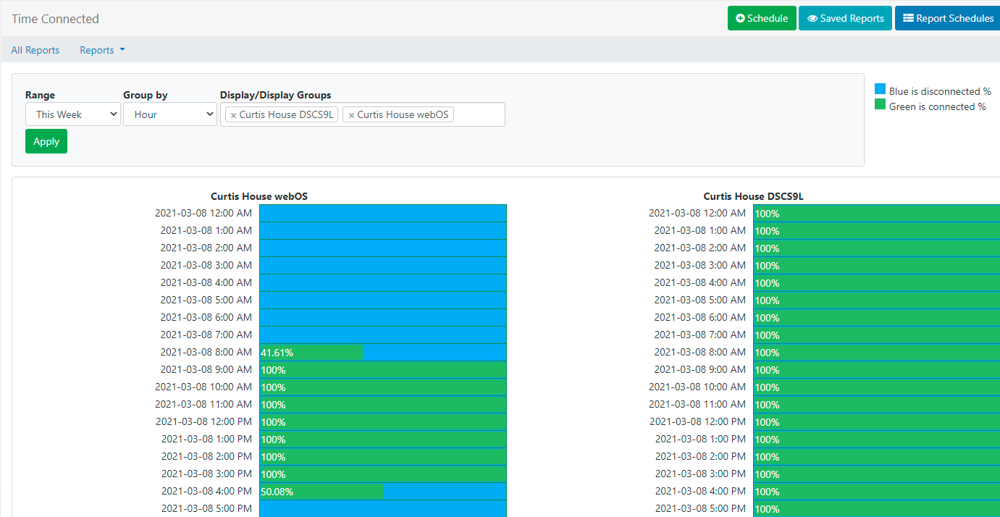
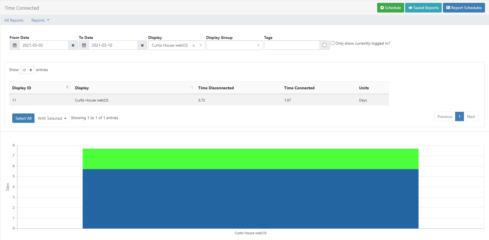
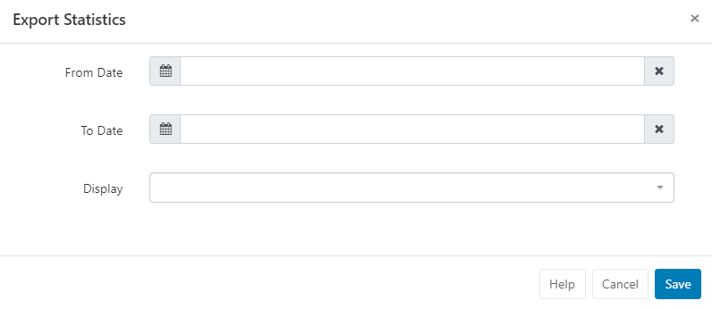
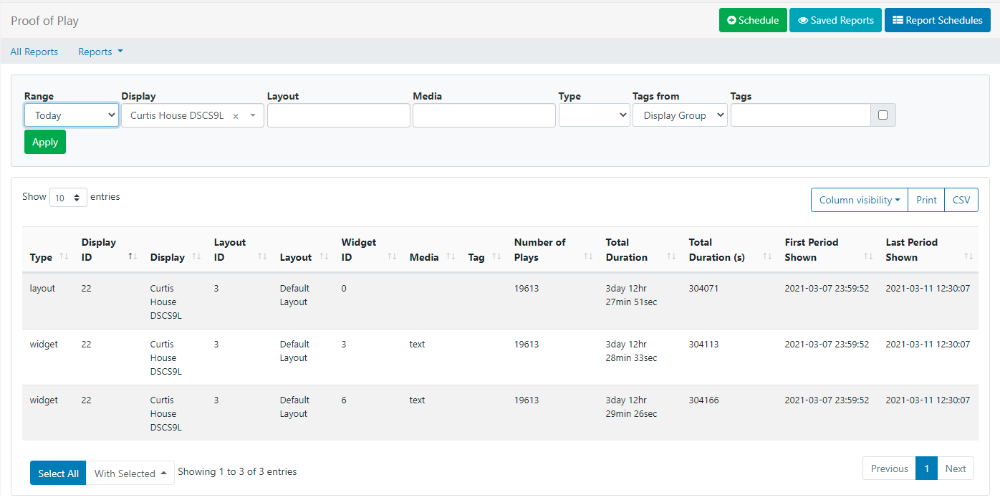
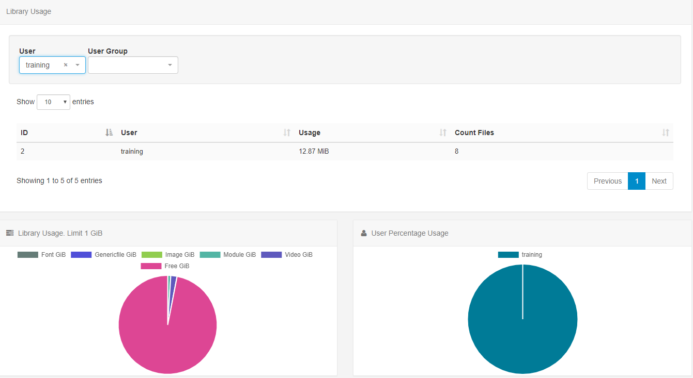
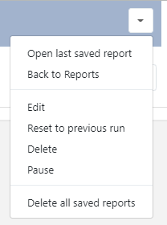

<!--toc=displays-->

# レポーティング

[[PRODUCTNAME]]は、[機能と共有](users_features_and_sharing.html) オプションを有効にしたユーザーに対して、CMS内でレポートを表示するための有用な**メトリックス**を提供します。これらは、ディスプレイのパフォーマンスや使用状況を分析するための集約エリアを提供するように設計されており、詳細な実行履歴レポートは、メインメニューの**レポーティング**セクションの**全レポート**からアクセスできます。

## ディスプレイ

- ### ディスプレイの統計情報:帯域幅

CMSは、コンテンツのためにXMDSに接続し、ディスプレイの情報を報告する際に、各ディスプレイが使用する**帯域幅**を記録します。

- 範囲を選択し、**適用**をクリックします。ディスプレイフィールドを空にすると、ディスプレイごとの帯域幅チャートの合計が表示されます。

- つの画面に絞り込んで**適用**をクリックすると、プレーヤーがXMDSに行った各呼び出しを個別に確認することができます。

{tip}
1台のDisplayにフィルタリングすることで、帯域の使用状況を把握することができます。
{/tip}

{tip}
[ディスプレイ](displays.html)ごとに帯域制限を設定できることをご存知ですか!
{/tip}

**全レポート** ボタンを使って レポーティングダッシュボードに戻るか、**レポート** ドロップダウンメニューを使って他の 'ディスプレイ' レポートを選択し、表示します。

- ### 接続時間／切断時間

CMSは、すべてのディスプレイ/ディスプレイグループのオン/オフイベントを記録し、ディスプレイの稼働状況に関する詳細を提供します。

接続時間レポートでは、接続されている割合（緑色で表示）と切断されている割合（青色で表示）の内訳が表示されます。

- **範囲**を選択し、**グループ集計**で時間、または月日を選択します。

- ディスプレイ/ディスプレイグループ欄を空欄にしてすべて表示するか、ディスプレイ/ディスプレイグループを選択して表示します。

- **適用**をクリックします。

**要約**では、ディスプレイ/ディスプレイグループの指定した日付間の内訳と、接続/切断された日数が表示されます

##  実行証明

各**ディスプレイ**は、表示した内容について、実行証明レポートを提供するための情報を収集することができます。

実行証明レポートを収集するには、**統計情報**を有効にし、[ディスプレイプロファイル設定](displays_settings.html) で**集計レベル**を設定します。

統計収集は、設定ページで **管理者** がデフォルトで有効にし、ユーザーが [レイアウト](layouts.html), [Playlist](media_playlists.html), [メディアライブラリー](media_library.html) から追加/編集する際、およびレイアウトまたはプレイリストタイムライン上の **ウェジット**の**オフ**/**オン**/**継承**を選択して追加/編集して設定することが可能です。

レポートは以下の情報が記録されて提供することができます。

- **レイアウト**
- **メディア**
- **ウェジット**
- **イベント**

{tip}
プレーヤーが外部センサーからの収集に対応している場合、イベントの統計情報を記録し、レポートに表示することができます。
{/tip}

- ### 実行証明: エキスポート

**エキスポート**でディスプレイの開始と終了oの日付を選択すると、CSVにエクスポートされ、すべての実行証明データを簡単に見ることができます。

### 実行証明: レポート

- ドロップダウンから**範囲**を選択するか、独自の日時を指定し、必要に応じてフィルタフィールドを使用してください。
- **適用**をクリックします。

{tip}
返された結果はCSVで出力可能です!
{/tip}

**全レポート**をクリックしてレポートダッシュボードに戻るか、**レポート**のドロップダウンを使って利用可能な実行証明から選択します。

### チャート: レイアウト、メディア、イベント別の概要/状況

チャートは、選択したレイアウト、メディア、イベントの再生時間や再生回数を集計して表示します。

- **範囲**を選択してください。
- **タイプ**を選択し、ドロップダウンを使用して選択したタイプをさらに指定します。
- **適用**をクリックします。

## ライブラリ

### ライブラリの利用状況

CMSの全ユーザーのライブラリの利用状況を表示したり、フィルターをかけて個々のユーザー/ユーザーグループの利用状況の概要を確認することができます。

### スケジュール

レポートは、**日次**、*週次**、*月次**、*年次**に実行するようスケジュールすることができます。

{tip}
**チャート: 配信**と**チャート: 要約レポート**の**スケジュール**ボタンを有効にするには、**タイプ**と名前の付いたレイアウト/メディア/イベントが選択されている必要があります。
{/tip}

- **スケジュール**ボタンをクリックし、特定のレポートタイプに必要なフォームフィールドを入力します。

- メールを送るべきですか？のチェックボックスをオンにすると、レポートのPDFをユーザーにEメールで送信することができます。

{tip}
管理者は、メインメニューの**管理**セクションにある**設定**ページの全般タブから、エクスポートしたレポートに表示される**ロゴ**を無効にすることを選択できます!
{/tip}

{tip}
スケジュールレポートは、**Eメールアドレス**フィールドに入力された追加のEメールアドレスにEメールで送信することもできます。

この機能を使用するには、メインメニューの**権利**セクションの下にあるCMS **設定**ページのネットワークタブで、管理者が**送信Eメールアドレス**を設定していることを確認してください。
{/tip} 

### レポートスケジュール

- オーナー/タイプ別の全スケジュールを表示するには、**レポートスケジュール** ボタンをクリックします。

- その他のオプションについては、レポートの行メニューを使用してください。

  

### 保存レポート 

**保存レポート**をクリックすると、すべての保存済みレポートが表示されます。

{tip}
チェックボックスを使って、自分の実行レポートだけを表示することができます
{/tip}

保存されたレポートの表示、スケジュール、PDFへのエクスポート、削除は、行メニューから行います。

{tip}
**レポートスケジュール**と**保存レポート**は、CMSメニューの**レポート**セクションから直接アクセスすることも可能です。
{/tip}

