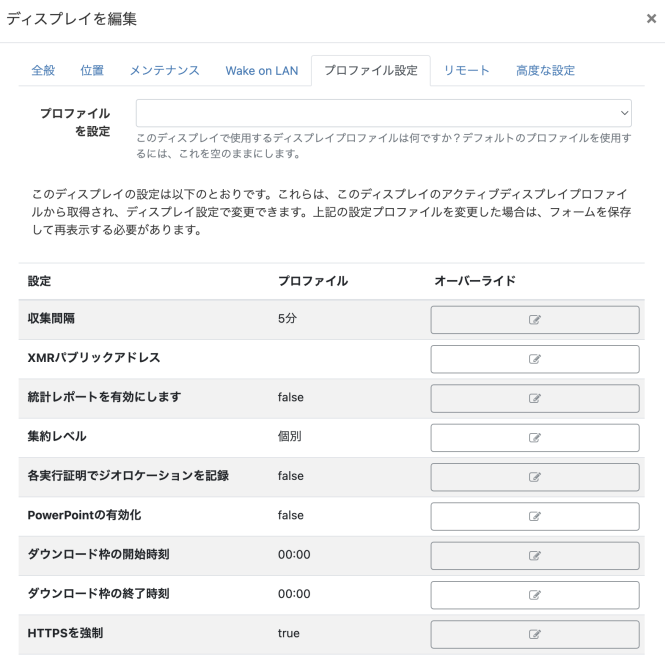

<!--toc=displays-->
# ディスプレイ設定 

ディスプレイは、一度接続するとCMSから自動的に設定され、ディスプレイ設定プロファイルで管理することができます。

各ディスプレイにはデフォルトの**ディスプレイプロファイルの設定**があり、必要な設定に合わせて管理者がカスタマイズすることができます。

ディスプレイ設定プロファイルを新規に作成し、**ディスプレイ**に直接割り当てることができます。

利用可能なプロファイルの一覧は、メインメニューの**ディスプレイ**セクションにある**ディスプレイ設定**から確認することができます。

各プロファイルには、**名前**、**タイプ**、およびそれが**デフォルト**であるかどうかを示すフラグがあります。デフォルトのプロファイルは、対応するタイプのディスプレイに自動的に割り当てられます。

## プロファイルの編集

表示したいプロファイルの行メニューから、**編集**をクリックします。プロファイルの編集フォームで、利用可能な設定を調整します。

各設定は、各タブのフォームフィールドの下で説明されています。

{tip}
行メニューの **コピー** をクリックすると、プロファイルの別バージョンを作成できます。必要に応じて調整し、新しいプロファイルをすばやく簡単に作成できます。
{/tip}

## 主な設定項目

### 収集間隔

**一般**タブにあるドロップダウンメニューで、プレーヤーが新しいコンテンツをチェックする頻度を選択します。これは、プレーヤーがCMSと通信した後、ここで設定した間隔で、内容に変更がないか再度チェックすることを意味します。

{tip}

**シナリオ**

プレーヤーは、収集間隔を24時間に設定すると、変更がないかチェックし、保留中の変更を処理し、次の24時間の収集まで待ちます。この間に変更があった場合、プレーヤーは再度チェックする時までその変更は反映されません。
{/tip}

プレーヤーのディスプレイプロファイルが変更された場合、その変更はその前の接続間隔に従って接続された後にプレーヤーのみに認識されます。

{tip}

**シナリオ**

収集間隔を24時間に設定したプレーヤーが午後12時にチェックを行った場合、翌日の午後12時まで、行われた変更を再度チェックすることはありません。24時間の間隔が過ぎると、新しい変更が更新され、この時点から新しいプロファイルに基づいて変更を収集するようになります。
{/tip}

XMRの設定により、収集間隔の設定に関係なく、変更を即座にプレーヤーに伝えることができるように設定できます。これは、ディスプレイ・プロファイルを変更する必要なく、ディスプレイに迅速かつダイナミックな変更を加えることができることを意味します。

{white}

プレイヤーアクションが必要な場合は、CMSをXMRインスタンスと対話するように設定することができますので、管理者にお問い合わせください。

{/white}

{tip}
5分以上を目安に、15分～30分程度が一般的な設定です。
{/tip}

### 統計レポートを有効にする

選択した**ディスプレイプロファイル**を使用するすべての**ディスプレイ**に対して、**実行履歴レポート**の統計情報の収集を有効/無効にするには、ボックスにチェックを入れます/外す。

有効な場合、**集約レベル** ドロップダウンを使用して、すべてのレイアウト/メディア/ウィジェットアイテムに適用される実行履歴統計の収集の必要なレベルを設定します。

- **個別** - デフォルトで指定された統計情報を収集する。
- **毎時** - デフォルトで1時間ごとに収集されます。
- **毎日** - デフォルトで毎日収集されます。

ディスプレイのジオロケーションがわかっている場合、チェックボックスを有効にすると、各実行履歴の記録に対してロケーションが記録されます。モバイルディスプレイを使用しているユーザーは、必要に応じてこの設定をオンにすることができます。

{tip}
プレイヤーは「完了した記録」のみを集計し、ウィジェットの持続時間が終了した時点で収集されるため、ウィジェットの持続時間が3時間の場合、ウィジェットが終了した時点で統計が記録されることになります。
{/tip}

### ダウンロードと更新の時間枠

**ネットワーク**タブで、CMSからの**ダウンロード**とプレイヤーへの**更新**の時間枠を設定することができます。

####ダウンロード枠の時間帯

- 開始時刻と終了時刻を選択すると、CMSに接続し、変更内容をダウンロードすることができます。

ダウンロード時間枠の設定外でコンテンツを変更した場合、プレーヤーは変更をダウンロードすることができず、代わりに割り当てられたデフォルトレイアウトまたはスプラッシュ画面が表示される可能性があります。

{tip}
デフォルトの00:00 - 00:00に設定すれば、常に時間枠を開けた状態になります！
{/tip}

#### 更新枠の時間帯

- アプリケーションの更新をインストールする開始時刻と終了時刻を選択します。

新しいバージョンのプレーヤーなど、プレーヤーに更新をダウンロードする時間を定義します。これは、新規または既存のスケジュールの変更も含めて、プレイヤーが更新されます。コンテンツへの変更は、設定された更新ウィンドウのタイミングでは更新されません。

{tip}
この設定は、割り当てられたレイアウト、または遅れて公開されたレイアウトと組み合わせて使用し、更新枠の間に公開するのが最適です。
{/tip}

### HTTPSを強制

このオプションは、CMSへのディスプレイのDisplays接続をHTTPSで行うように強制します。

**プロファイルの編集**フォームの**ネットワーク**タブで、**HTTPSを強制**チェックボックスを使用します。

{tip}
このオプションは、個々のディスプレイに対してオーバーライドすることができます。
{/tip}

### 稼働時間

あらかじめ設定された[配信時間帯](scheduling_dayparting.html)によって、ディスプレイの**稼働時間**を設定する。。

- Windows、Android、Linuxのプレイヤーは**ネットワーク**タブ、webOS、Tizenのプレイヤーは**一般**タブを使用してください。

- ドロップダウンメニューで、適用する配信時間帯を選択します。

ディスプレイがオフラインのときに送信されるような「Eメールアラート」は、指定された営業時間外には送信されません。

### レイアウトの有効期限

**高度な設定**タブにあるチェックボックスを使用すると、プレーヤーがCMSからアップデートを受信したときに、[[PRODUCTNAME]]のレイアウトを直ちに期限切れにして再生を停止するように指示できます。

{tip}
長時間のレイアウトに便利です。
{/tip}

### 複数のデコーダーを使用する（Xibo for Android）

v2 R207より、ビデオコンテンツでのギャップレス再生は、Android端末に複数のデコーダーを搭載する必要があります。この設定は[詳細設定]タブで確認でき、自動的に[デバイスデフォルト]が使用されます。

{tip}
再生がオンに設定されている状態で問題が発生した場合、再生が停止します。
{/tip}

### 端末のタッチ機能を有効にする（Xibo for Android）

v3 R300から、**高度な設定**タブに移動し、デバイスをタッチスクリーンとして使用する場合、このオプションを有効にします。

{tip}
このオプションを有効にすると、プレイヤーに一度だけメッセージが表示されますので、手動で解除する必要があります。
{/tip}

無効のままだと、画面をタッチすると、**アクションバーモード**のオプションに従ってアクションバーが表示されます。

## プロファイルを追加

プロファイルを追加ボタンをクリックし、名前を入れて**ディスプレイタイプ**を選択し、保存します。

プロフィールを編集フォームが表示されますので、必要事項を入力してください。

## プロファイルを削除

ディスプレイプロファイルの削除は、選択したプロファイルの行メニューオプションで行います。

各タイプの**デフォルトが1つ**ずつ残っていることを確認してください。

## ディスプレイでの設定

**デフォルトのプロファイル**は、同じタイプのすべてのディスプレイに自動的にその設定を適用します。ディスプレイの**編集フォーム**の**プロファイル設定**タブで必要な**設定プロファイル**を選択すると、ディスプレイにデフォルト以外のプロファイルをオーバーライドすることができます。また、各設定は個々のディスプレイに合わせてオーバーライドすることができます。

