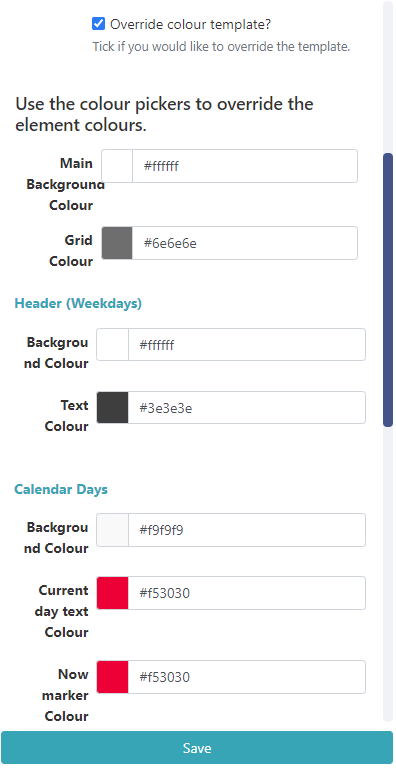

<!--toc=widgets-->

# カレンダー

カレンダーウィジェットは、**iCalフィード**からのイベントを、**日間、週間**または**月間**のカレンダービューで表示する簡単な方法を提供します。

## ウィジェットを追加

[ウィジェット](layouts_widgets.html)ツールバーの**カレンダー**をクリックし、追加またはドラッグ＆ドロップで追加します。

追加すると、設定オプションがプロパティパネルに表示されます。

- 識別しやすいように **名前** を記入してください。
- 必要であれば、デフォルトの**期間**をオーバーライドするよう選択します。

### 設定

- リンクするiCalの**URL**を指定してください。
- ドロップダウンを使って、イベントの表示に使用する**カレンダーの種類**を選択します。

#### スケジュール

- イベントが返されない場合に表示される**メッセージ**を入力してください。

- **間隔**フィールドを使用して、特定の期間のイベントをフィルタリングします。'1 day'や'2 weeks' のような自然言語を使用して、選択した期間内のイベントを返します。

- チェックボックスをオンにすると、開始日と終了日が定義された**日付範囲**を代わりに入力することができます。
  

#### 日間/週間

- **開始時間**と終了時間**を設定し、イベントを表示するウィンドウを定義します。

{tip}
週末を削除するオプションが、週間カレンダーと月間カレンダーの両方で利用可能です。
{/tip}

#### 全てのカレンダーの種類には、以下のオプションがあります。

- **終日イベントを除外** を指定すると、フィードから除外され、表示されなくなります。
- **現在のイベントを除外**はフィードから除外して、表示されないようにします。
- **イベントタイムゾーンを使用**、はCMSタイムゾーンを代わりに使用する場合は選択を解除します。
- フィードが独自のタイムゾーンを使用するよう指定した場合、**カレンダータイムゾーンを使用**します。CMSのタイムゾーンを使用する場合は、選択を解除してください。
- フィードが**Windows**から来る場合、このチェックボックスを使用します。

### 外観

選択したカレンダーの種類に応じて、利用可能なオプションを使用して外観を設定します。

#### スケジュール

- デフォルトのHH:mmに代わる**時刻の形式**を選択します。
- チェックボックスを使用すると、カレンダーに時刻の**現在マーカー**を表示することができます。
- iCalフィードにイベントの説明がある場合、その**イベントの説明を表示**チェックボックスを使用します。
- **文字サイズ**を設定します（1が最小）。
- テンプレートに適用するカラースキームを**ライト**または**ダーク**から選択します。

#### 日間

- デフォルトのHH:mmに代わる**時刻の形式**を選択します
- チェックボックスを使用すると、カレンダーに時刻の**現在マーカー**を表示することができます。
- **文字サイズ**を設定します（1が最小）
- イベントの行に適用する**グリッドステップ**の期間を分単位で入力します。
- テンプレートに適用するカラースキームを**ライト**または**ダーク**から選択します。

#### 週間

- デフォルトのHH:mmに代わる**時刻の形式**を選択します。
- チェックボックスを使用すると、カレンダーに時刻の**現在マーカー**を表示することができます。
- **文字サイズ**を設定します（1が最小）
- **週名の長さ**から長い・中間・短い を選んでください。
- イベントの行に適用する**グリッドステップ**の期間を分単位で入力します
- テンプレートに適用するカラースキームを**ライト**または**ダーク**から選択します。

#### 月間

- デフォルトのHH:mmに代わる**時刻の形式**を選択します。
- チェックボックスを使用すると、カレンダーに時刻の**現在マーカー**を表示することができます。
- **文字サイズ**を設定します（1が最小）
- **週名の長さ**から長い・中間・短い を選んでください。
- イベントの行に適用する**グリッドステップ**の期間を分単位で入力します
- テンプレートに適用するカラースキームを**ライト**または**ダーク**から選択します。

すべてのカレンダー種別は、**カラーテンプレートを上書き** のチェックボックスを使用して代替色を提供し、選択したカレンダーのすべての要素を変更するオプションがあります。

### キャッシュ

**更新間隔**に適切な時間を分単位で入力し、可能な限り高く設定します。これは、iCalフィードからデータが要求される頻度を決定します。カレンダーが数日前にスケジュールされたイベントしか変更されない場合は、これを長い期間に設定できます。

{tip}
リモートフィードにはできるだけアクセスしないようにするのがベストプラクティスです。
{/tip}

## トリガー

このタブを使用して、**現在のイベント**または**イベントなし**の時に、ウェブフックで**アクション**をトリガーすることができます!

{tip}

**シナリオの例**:

あるユーザーが、レイアウト上のカレンダーウィジェットを使って会議室のカレンダーを設定し、現在の会議室の使用状況を表示しています。

- ユーザーはまず、LED IoT デバイスまたは Philips 社の商用ディスプレイの一部に搭載されている LEDS にコマンドを発行する **シェルコマンド** を作成する必要があります。
- 次に、[会話型アクション](layouts_interactive_actions.html)を **レイアウト** 上に定義する必要があり、これは **ウィジェットに移動** して **画面をターゲット** とし、 **対話型どろわー** に設定された **シェル コマンド ウィジェット** を使用するものです。
- カレンダーウィジェットの**トリガー**タブを使用して、**現在のイベント**と**イベントなし**の**ウェブフック**をトリガーするコードを割り当てます。

{white}
どのようなコマンドを使用するかについては、管理者に相談してください。
{/white}

{/tip}

## アクション

このウィジェットにはアクションを付けることができます。詳しくは[対話型アクション](layouts_interactive_actions.html)のページを参照してください。

## データフォーマット - PHP

[[PRODUCTNAME]]は、PHPの正しい日付書式であればどのようなものでも受け入れるはずです。以下の文字が認識され、使用する>ことができます。

| フォーマット文字 | 説明                                                  | 返される文字の例                 |
| ---------------- | :----------------------------------------------------------- | --------------------------------------- |
|                  | **日**                                                      |                                         |
| d                | ゼロから始まる２桁の日付              | 01 から 31                                |
| D                | 日を表すテキスト, ３文字            | Mon から Sun                         |
| j                | ゼロをつけない日付                       | 1 から 31                                 |
| l                | (小文字‘L’) 日を表す完全な文字列 | Sunday から Saturday                 |
| N                | ISO-8601で定義された曜日を表す数字(PHP 5.1.0で追加された) | 1 (月曜日) から 7 (日曜日)   |
| S                | 日にちに対する英語の序数サフィックス、2文字| st, nd, rd または thとともに使われる     |
| w                | 曜日の数字表現         | 0 (Sunday) から 6 (Saturday) |
| z                | 年初からの日（0から始まる)                        | 0 から 365                           |
|                  | **週**                                                     |                                         |
| W                | ISO-8601で規定する週の数字, 週は月曜日から始まる(PHP 4.1.0で追加) | 42 (一年の中の４２週目)          |
|                  | **月**                                                    |                                         |
| F                | 月のテキスト表現, January や March | January から December                |
| m                | ゼロで始まる月の数字表現        | 01 から 12                           |
| M                | 月の短いテキスト表現、３文字     | Jan から Dec                         |
| n                | 月の数字表現、先頭にゼロはつかない| 1 から 12                            |
| t                | 月の日数                            | 28 から 31                           |
|                  | **年**                                                     |                                         |
| L                | うるう年かどうか year                                     | 1 うるう年, 0 それ以外.    |
| o                | ISO-8601できていされた年. これはYと同じ値です。ただし、ISOの週番号（W）が前後の年に属している>場合は、その年が代わりに使用されます。(PHP 5.1.0で追加) | 1999 または 2003                            |
| Y                | 年の４桁数字表現            | 1999 または 2003                            |
| y                | 年の２桁数字表現                         | 99 or 0                                 |
|                  | **時間**                                                     |                                         |
| a                | 小文字アンティメリディアムとポストメリディアム                    | am または pm                                |
| A                | 大文字アンティメリディアムとポストメリディアム                    | AM または PM                                |
| B                | スウォッチインターネット時間                                         | 000 から 999                         |
| g                | 先行ゼロなしの時間の12時間形式              | 1 から 12                            |
| G                | 先行ゼロなしの時間の24時間形式              | 0 から 23                            |
| h                | 先行ゼロありの時間の12時間形式                 | 01 から 12                           |
| H                | 先行ゼロありの時間の２４時間形式                 | 00 から 23                           |
| i                | 先行ゼロ付き分                                   | 00 から 59                                |
| s                | 先行ゼロ付き秒                                  | 00 から 59                           |
| u                | マイクロ秒（PHP 5.2.2で追加） DateTimeがマイクロ秒で作成された場合、DateTime :: format（）はマイクロ秒をサポートするのに対して、date（）は常に000000を生成します。 | 654321                                  |
|                  | **タイムゾーン**                                                 |                                         |
| e                | タイムゾーン識別子（PHP 5.1.0で追加）                     | UTC, GMT, Atlantic/Azores               |
| I                | （大文字のi）日付が夏時間であるかどうか| 夏時間の場合は1、それ以外の場合は0です。 |
| O                | グリニッジ時間（GMT）との時差                  | +0200                                   |
| P                | グリニッジ標準時（GMT）と時間と分の間の差（PHP 5.1.3で追加） | +02:00                                  |
| T                | タイムゾーンの略語                                        | EST, MDT …                              |
| Z                | 秒単位のタイムゾーンオフセット。 UTCより西のタイムゾーンのオフセットは常に負で、UTCより東のタ>イムゾーンのオフセットは常に正です。 | -43200 through 50400                    |
|                  | **フル日付/時刻**                                           |                                         |
| c                | ISO 8601 日付（PHP 5で追加）                               | 2004-02-12T15:19:21+00:00               |
| r                | » RFC 2822 フォーマット日付                                    | Thu, 21 Dec 2000 16:01:07 +0200         |

