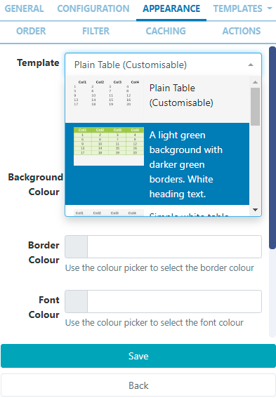

<!--toc=widgets-->

# データセットビュー

データセットビューウィジェットは、データセットと一緒に使用し、情報を表形式で表示します。

**データセットデータ**が変更されると、レイアウトに含まれるデータセットビューウィジェットは、新しいデータで更新されます。

レイアウトにデータセットビューウィジェットを追加する前に、データセットを作成し定義する必要があります。詳しくは、[ データセット ]（media_datasets.html）ページを参照してください。

## ウィジェットを追加

[ウィジェット](layouts_widgets.html)ツールバーからデータセットビューをクリックし、追加またはドラッグ＆ドロップ で追加できます。 

- 追加時に、ドロップダウンメニューから使用するデータセットを選択します。

{tip}
戻るボタンをクリックすると、別のデータセットに変更することができます。オプションは、新しいデータセットに合わせて再設定する必要があります。
{/tip}

保存されると、さらなるオプションが利用可能になります。

- 識別しやすいように **名前** を記入してください。
- 必要であれば、デフォルトの**期間**を上書きするよう選択します。
- チェックしてページごとの継続時間を使うか、チェックせずにウィジェット全体の継続時間を使うかを選択します。

### 設定


- 使用する列は、**選択された列**にドラッグして選択します。
- **表の見出しを表示**する場合は、ボックスにチェックを入れてください。
- **上限**と**下限**の行数制限を設定します。
- **1ページの表示件数**を使用して、データを複数ページに分割します。

### 外観

- ドロップダウンメニューから、**テンプレート**を選択します。



- 最初のテンプレートオプションはカスタマイズ可能で、ユーザーは背景、ボーダー、フォントのカラーリングを選択し、使用するカスタムフォントとフォントサイズを選択することができます。
- その他のテンプレートは、ユーザーがカスタムフォントとサイズを選択することができます。
- 選択したテンプレートを上書きするにチェックを入れて、HTMLとCSSを入力します。
- テンプレートタブをクリックして、編集するテンプレートを選択します。


### オプションのスタイルシート

テンプレートを上書きする際に、テンプレートに適用するCSSを入力します。

{tip}
このオプションのテンプレートは、CMSが生成する出力を「微調整」するための上級ユーザー向けのものです。このページの一番下までスクロールして、スタイルシートの例をご覧ください。
{/tip}

### データなしテンプレート

表示すべきデータがないときに、空白の表示にならないように、メッセージを入れてください。

### 順序

データセットの結果は、任意のカラムで並べ替えることができます。

- ドロップダウンメニューから、並べ替える列を選択します。
- さらにフィールドを追加するには、`+`ボタンをクリックします。
- SQLコマンドで、より複雑な順序付けを行うには、order句を使用します。

### フィルタ

データセットの結果を、任意の列でフィルタリングすることができます。

- データセットの結果をインクルード/オミットするために、句ビルダーを使用します。
- さらにフィールドを追加するには、`+`ボタンをクリックします。
- SQLコマンドで、より複雑なフィルタリングを行うには、filter句を使用します。

### キャッシュ

プレーヤーは、オフラインで再生したり、繰り返しダウンロードするのを防ぐために、このメディアのコンテンツを**キャッシュ**することができます。この数値はできるだけ大きくしてください。

{tip}
プレーヤーがオフラインのとき、**ノーデータテンプレート**に切り替えるタイミングを決定するための'フレッシュネスチェック'を設定します。
{/tip}

## アクション

このウィジェットにはアクションを付けることができます。詳しくは[対話型アクション](layouts_interactive_actions.html)のページを参照してください。

## スタイルシートの例

```css
table.DataSetTable {
font-family:"Trebuchet MS", Arial, Helvetica, sans-serif;  
width:100%;
border-collapse:collapse;
}

tr.HeaderRow {
font-size:1.1em;
text-align:center;
padding-top:5px;
padding-bottom:4px;
background-color:#A7C942;
color:#ffffff;
}

tr#row_1 {
color:#000000;
background-color:#EAF2D3;
}

td#col_1 {
color:#000000;
background-color:#EAF2D3;
}

td.DataSetColumn {
color:#000000;
background-color:#EAF2D3;
border:1px solid #98bf21
}

tr.DataSetRow {
text-align:center;
color:#000000;
background-color:#EAF2D3;
border:1px solid #98bf21
padding-top:5px;
padding-bottom:4px;
}

th.DataSetColumnHeaderCell {
font-size:1em;
border:1px solid #98bf21;
padding:3px 7px 2px 7px;
}

span#1_1 {

}

span.DataSetColumnSpan {

}
```
