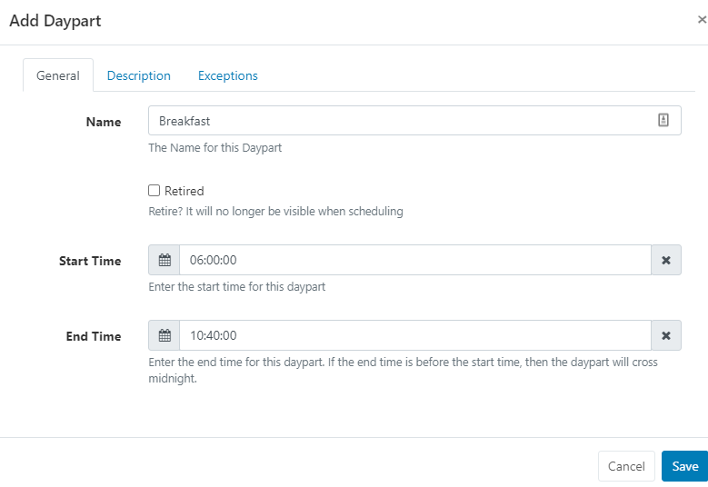
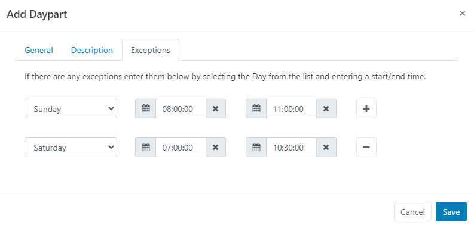

<!--toc=scheduling-->
# 配信時間帯

> 放送番組では、1日をいくつかのパートに分け、その時間帯に適した別の種類のラジオ番組やテレビ番組を放送することをDayparting(放送時間帯)と言います。
> -- Wikipedia

[[PRODUCTNAME]]は、曜日例外を含む複数の配信時間帯の作成をサポートしています。つまり、1つの日を必要な数だけ**事前に定義された**パートに分割することができます。

{tip}
典型的なユースケースは、朝食、昼食、夕食のために異なるコンテンツを表示する接客業のユーザーです。ユーザーは朝食、昼食、夕食の配信時間帯を作成し、それぞれを異なる日に開始、終了することで、簡単にスケジューリングすることができます。
{/tip}

[ディスプレイの時間枠](displays_settings.html) を設定するために、**配信時間帯**も作成・定義することができるようになりました。

## 配信時間帯を作成

デイパーツは、メニューの「配信時間帯」ページで管理し、**配信時間帯を追加** ボタンをクリックすることで作成されます。フォームフィールドに必要事項を入力し、配信時間帯を定義します。

一度作成した配信時間帯は、イベントのスケジューリング時に**配信時間帯ドロップダウン**リストに表示されます。

{tip}
下の配信時間帯フォームは、朝食用の配信時間帯の例を示しています。

土曜日と日曜日は例外的に、朝食の開始と終了の時間が異なるように設定されています。

スケジューリング時に、**朝食**の配信時間帯がドロップダウンリストに表示され、選択することができます。選択すると、開始/終了日時のセレクタが日付のみのセレクタに変わり、イベントの発生する曜日に従って、配信時間帯の設定から時間が取得されます。
{/tip}

## 配信時間帯を編集

配信時間帯グリッドの行メニューから、配信時間帯の編集・削除、[共有](users_features_and_sharing.html)が可能です。

{tip}
配信時間帯の開始/終了時刻や例外を更新すると、既存の未来のイベントが新しく定義された時刻で更新されます。現在の時刻以降に繰り返されるように設定された既存のスケジュールは、更新された情報を反映するために新しいスケジュールが作成されます。
{/tip}
